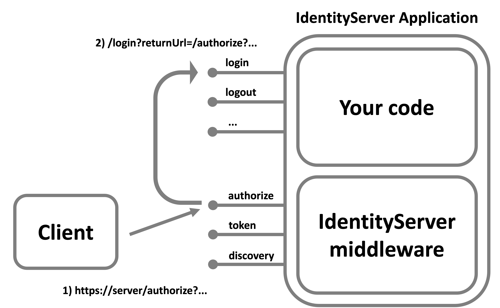

+++
title = "Login"
date = 2020-09-10T08:20:20+02:00
weight = 10
chapter = true
+++

# Login

The login page is passed a returnUrl. 
This is state that needs to be maintained during the user's login workflow.
Once the user is logged in, the login page will redirect the user back to the returnUrl.

A user can authenticate in any way you would like to allow them to.
Commonly a username or password (and possibly other credentials like MFA) can be used. 
But it's also possible that user uses an external login system, such as a social login, or a federated enterprise SSO system.
Really, any means that you can code to validate the identity of the user is possible (e.g. windows authentication).

A user's session is determined by the ASP.NET cookie authentication system.
So the results of any of the above will ultimately the result in a cookie that your workflow issues.

In order for Duende IdentityServer to issue tokens on behalf of a user, that user must sign-in.

## Session Management
The authentication session is typically tracked with a cookie managed by the [cookie authentication](https://docs.microsoft.com/en-us/aspnet/core/security/authentication/cookie) handler from ASP.NET Core.

Duende IdentityServer registers two cookie handlers by default. 
One for the authentication session and one for temporary external cookies. 

These are used by default and you can get their names from the *IdentityServerConstants* class (*DefaultCookieAuthenticationScheme* and *ExternalCookieAuthenticationScheme*) if you want to reference them.

Only basic settings are exposed for these cookies (expiration and sliding), but you can register your own cookie handlers if you need more control.
IdentityServer uses whichever cookie handler matches the *DefaultAuthenticateScheme* configured for the ASP.NET Core application when using *AddAuthentication*.

{}
In addition to the authentication cookie, IdentityServer will issue an additional cookie which defaults to the name "idsrv.session". This cookie is derived from the main authentication cookie, and it used for the check session endpoint for :ref:`browser-based JavaScript clients at signout time <refSignOut>` TODO. It is kept in sync with the authentication cookie, and is removed when the user signs out.
{}

## Overriding cookie handler configuration
If you wish to use your own cookie authentication handler, then you must configure it yourself.
This must be done in *ConfigureServices* after registering IdentityServer in DI (with *AddIdentityServer* TODO link to extension method reference).

For example:

```cs
    services.AddIdentityServer()
        .AddInMemoryClients(Clients.Get())
        .AddInMemoryIdentityResources(Resources.GetIdentityResources())
        .AddInMemoryApiResources(Resources.GetApiResources())
        .AddDeveloperSigningCredential()
        .AddTestUsers(TestUsers.Users);

    services.AddAuthentication("MyCookie")
        .AddCookie("MyCookie", options =>
        {
            options.ExpireTimeSpan = ...;
        });
```

{}
Since Duende IdentityServer sets up default cookie handlers internally, you must call *AddAuthentication* after *AddIdentityServer*.
{}


## Login Workflow
When Duende IdentityServer receives a request at the authorization endpoint and the user is not authenticated, the user will be redirected to the configured login page.
By default a path of */account/login* is used. You can change this value on the [options]().

The login page is the entry point into your custom login workflow. This might just involve simple username/password authentication, 
but can have arbitrary complexity involving multiple authentication factors, external authentication systems or custom user registration and provisioning.

Duende IdentityServer will pass a *returnUrl* query parameter to the login page. Simply return to this URL once you are done with your custom workflow and IdentityServer will continue with the session management and protocol work.



{}
Beware [open-redirect attacks](https://en.wikipedia.org/wiki/URL_redirection#Security_issues) via the *returnUrl* parameter. You should validate that the *returnUrl* refers to well-known location. See the [interaction service]() for APIs to validate the *returnUrl* parameter.
{}

## Login Context
On your login page you might require information about the context of the request in order to customize the login experience 
(such as client information or protocol parameters).
This is made available via the *[GetAuthorizationContextAsync]()* API.

## Issuing a cookie and Claims
Before you return control back to the IdentityServer middleware via the *returnUrl* you need to start the user session.

This is ultimately done via the ASP.NET Core *SignInAsync* extension method on *HttpContext*.

The user you are signing in must have at least a claim of type *sub* that contains the unique user identifier.
You can store additional claims in the user session if that makes sense for your scenario.

Some claims have special meaning an will be picked up by IdentityServer if you add them, e.g.:

* ***idp***

    Name of the identity provider used for sign-in (defaults to *local*)

* ***amr***

    Name of the authentication method used for user authentication (defaults to *pwd*)

* ***auth_time***

    authentication time in epoch format (default to current time)

* ***name***

    display name

While you can create the *ClaimsPrincipal* yourself, you can use IdentityServer extension methods and the *IdentityServerUser* class to make this easier:

```cs
// issue authentication cookie with subject ID and username
var isuser = new IdentityServerUser(user.SubjectId)
{
    DisplayName = user.Username
};

await HttpContext.SignInAsync(isuser, props);
```